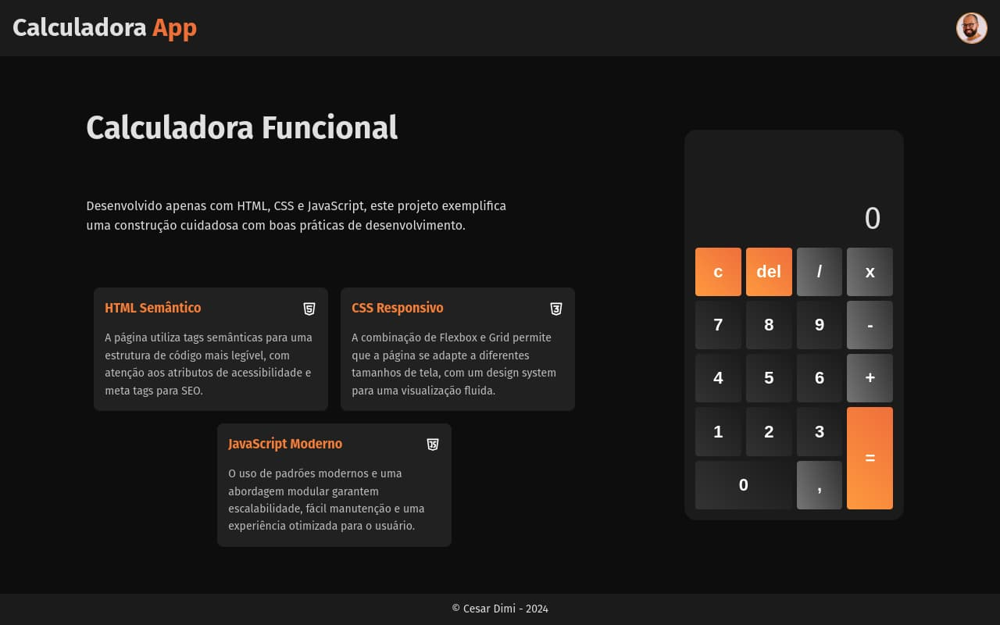

# Calculator App

## Descrição

Este projeto é uma calculadora funcional desenvolvida utilizando HTML, CSS e JavaScript. O objetivo é demonstrar boas práticas de desenvolvimento web, incluindo HTML semântico, design responsivo com CSS e programação modular com JavaScript.

## Estrutura do Projeto

- **HTML**: Utiliza tags semânticas para melhorar a acessibilidade e a estrutura do código.
- **CSS**: Emprega Flexbox e Grid para criar um design responsivo que se adapta a diferentes tamanhos de tela.
- **JavaScript**: Adota padrões modernos e uma abordagem modular para garantir escalabilidade e fácil manutenção.

## Funcionalidades

- **Operações Matemáticas**: Suporte para adição, subtração, multiplicação e divisão.
- **Manipulação de Entrada**: Permite a entrada de números, operadores e a utilização de funções como deletar, limpar e calcular resultados.
- **Design Responsivo**: Adapta-se a diferentes tamanhos de tela, garantindo uma experiência de usuário fluida em dispositivos móveis e desktops.
- **Acessibilidade**: Inclui atributos ARIA e suporte a navegação por teclado para melhorar a acessibilidade.

## Tecnologias Utilizadas

- **HTML**: Estrutura semântica da página.
- **CSS**: Estilização e design responsivo.
- **JavaScript**: Lógica da calculadora e manipulação de eventos.

## Instruções de Uso

1. **Clone o Repositório**

   ```bash
   git clone https://github.com/cesardmn/calculator_app.git
   ```

2. **Navegue para o Diretório do Projeto**

   ```bash
   cd calculator_app
   ```

3. **Abra o Arquivo `index.html` no Navegador**

   Abra o arquivo `index.html` em um navegador web para visualizar e usar a calculadora.

## Recursos e Metadados

- **Descrição**: "Explore esta calculadora funcional desenvolvida com HTML, CSS e JavaScript, demonstrando boas práticas de desenvolvimento web."
- **Palavras-chave**: calculadora funcional, desenvolvimento web, HTML, CSS, JavaScript, boas práticas de programação, acessibilidade web.
- **Autor**: Cesar Dimi
- **URL**: [https://cesardmn.github.io/calculator_app/](https://cesardmn.github.io/calculator_app/)
- **Imagem de Visualização**: 

## Contribuições

Se você deseja contribuir para o projeto, sinta-se à vontade para abrir uma _issue_ ou enviar um _pull request_ com melhorias ou correções. Certifique-se de seguir as boas práticas e manter a consistência com o estilo do código existente.

## Licença

Este projeto é de propriedade de Cesar Dimi e está licenciado sob a [Licença MIT](LICENSE).

## Contato

Para mais informações, você pode entrar em contato através do [perfil de Cesar Dimi](https://cesardmn.github.io/).